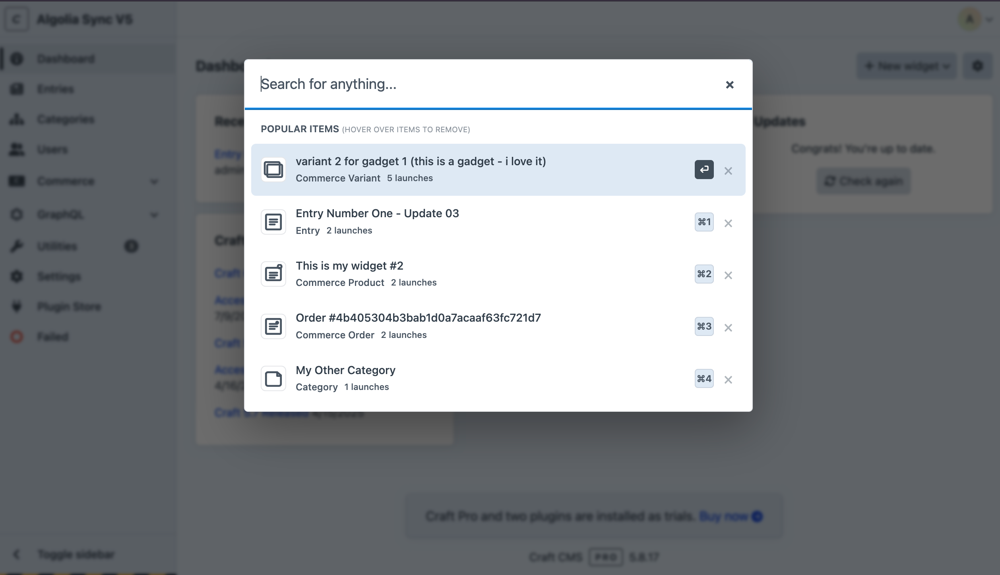
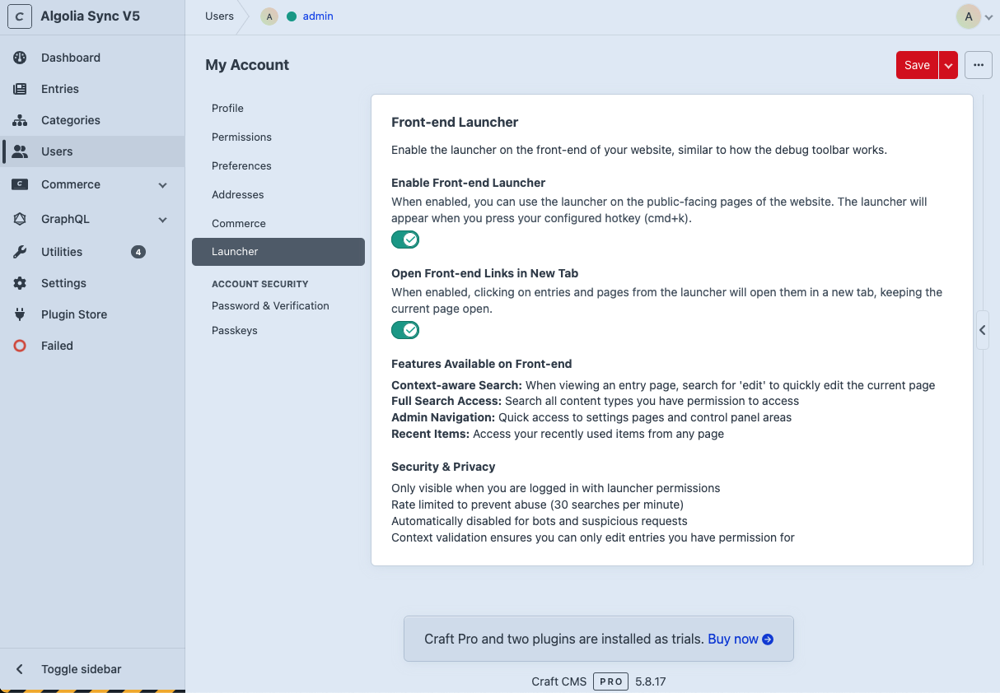
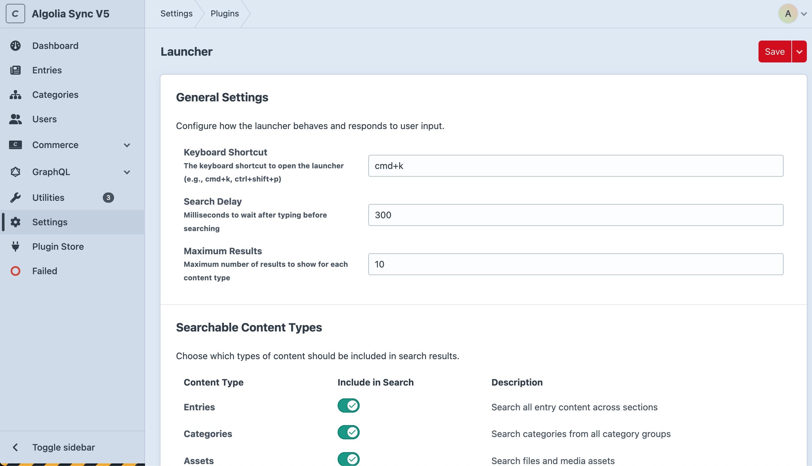
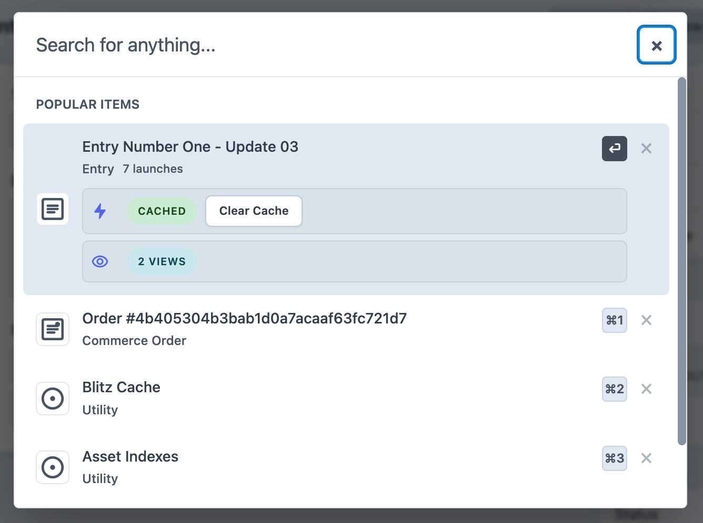

# Craft Launcher Plugin

A universal search launcher for the Craft CMS admin panel that provides quick access to content, settings, and navigation throughout your Craft installation. Think of it as Spotlight for macOS or Command Palette for VS Code, but specifically designed for Craft CMS with intelligent usage tracking.


*The launcher showing popular items with smart keyboard shortcuts and launch counts*

## Features

### Core Search & Navigation
- **Universal Search**: Quickly search across entries, users, categories, assets, globals, sections, entry types, and more
- **Browse Mode**: Type `*` to explore all content types and drill down into specific areas
- **Smart Navigation**: Jump to any section of the Craft control panel instantly  
- **Keyboard Shortcuts**: Navigate entirely with your keyboard for maximum efficiency
- **Theme Integration**: Seamlessly matches your Craft admin panel theme and styling
- **Permission-Aware**: Only shows content you have permission to access

### Intelligent Usage Tracking
- **Launch History**: Tracks which items you actually navigate to (not just search for)
- **Popular Items**: Shows your most-used items when you first open the launcher
- **Launch Count Display**: See how many times you've accessed each item
- **Individual Item Removal**: Remove specific items from your history with a subtle X button
- **Privacy Controls**: Enable/disable history tracking or clear all data

### Commerce Integration
- **Customer Search**: Find Commerce customers by name or email
- **Product Search**: Search products and variants
- **Order Search**: Find orders by reference number or customer details
- **Customer Name Fallbacks**: Handles missing customer names gracefully

### Advanced Content Types
- **Entry Types**: Search and navigate to entry type configurations
- **Section Management**: Quick access to section settings
- **Field Management**: Navigate directly to field definitions
- **Plugin Settings**: Access plugin configuration panels
- **User Management**: Find users and access their profiles

## Requirements

- Craft CMS 5.0.0 or later
- PHP 8.2 or later

## Installation

### Method 1: Via Composer (Recommended)

1. **Navigate to your Craft project:**
   ```bash
   cd /path/to/your/craft/project
   ```

2. **Install the plugin:**
   ```bash
   composer require brilliance/craft-launcher
   ```

3. **Enable the plugin:**
   ```bash
   php craft plugin/install launcher
   ```

### Method 2: Via Control Panel

1. Navigate to **Settings → Plugins** in your Craft admin panel
2. Click the **"Plugin Store"** button  
3. Search for **"Launcher"**
4. Click **"Install"** next to the Craft Launcher plugin
5. Follow the on-screen installation instructions

### Post-Installation

1. **Set Permissions**: Navigate to **Settings → Users → User Groups** and ensure your user groups have the "Access Launcher" permission
2. **Configure Settings**: Visit **Settings → Launcher** to customize keyboard shortcuts and search behavior
3. **Test It Out**: Press `Cmd+K` (Mac) or `Ctrl+K` (Windows/Linux) anywhere in the admin panel

## Usage Guide

### Opening the Launcher

- **Keyboard Shortcut**: Press `Cmd+K` (Mac) or `Ctrl+K` (Windows/Linux) from anywhere in the Craft admin panel
- **Same Shortcut to Close**: Press your keyboard shortcut again or `Esc` to close
- **Smart Initial Display**: Shows your most popular items when first opened (based on actual usage)

### Search Modes

#### **Universal Search Mode** (Default)
Just start typing to search across all enabled content types:
- `homepage` - Finds entries, categories, assets with "homepage" in the title
- `john` - Finds users, entries, or content authored by or mentioning "john"
- `products` - Finds entries, categories, sections, Commerce products related to products

#### **Browse Mode**
Type `*` to enter browse mode and explore your content systematically:

1. **Type `*`** - Shows all available content types
2. **Select a content type** - Use arrow keys or number keys (1-9) to select
3. **Browse all items** - See all entries, users, categories, etc. of that type
4. **Navigate normally** - Use Enter or click to open items

**Available browse categories:**
- **Entries** - All entry content
- **Categories** - Category items
- **Assets** - Media and files
- **Users** - User accounts
- **Global Sets** - Global content
- **Sections** - Entry section settings
- **Entry Types** - Entry type definitions
- **Category Groups** - Category group settings
- **Asset Volumes** - Asset volume settings
- **Fields** - Field definitions
- **Plugins** - Plugin settings
- **Settings** - System settings and configuration pages

### Launch History System

#### **How It Works**
The launcher tracks which items you actually navigate to (not just search for) and builds a personalized usage profile:

- **Recording**: Every time you click or press Enter on a search result, it's recorded
- **Frequency Tracking**: Items you use more often appear higher in the list
- **Intelligent Ranking**: Combines frequency with recency for optimal relevance
- **Per-User**: Each user has their own separate launch history

#### **Popular Items Display**
When you first open the launcher (without typing), you'll see:
- **Section Title**: "Popular Items (hover over items to remove)"
- **Launch Counts**: Each item shows how many times you've accessed it
- **Smart Ordering**: Most-used items appear first
- **Remove Options**: Hover over any item to see a subtle X button

#### **Managing Your History**
- **Remove Individual Items**: Hover over any popular item and click the X button
- **Clear All History**: Use the "Clear History" utility in plugin settings
- **Disable Tracking**: Turn off launch history in Settings → Launcher
- **Privacy**: All data is stored locally in your Craft database

### Commerce Integration

If Craft Commerce is installed, the launcher provides enhanced e-commerce search:

#### **Customer Search**
- Search by customer name or email address
- Graceful handling of customers without names
- Direct links to customer management pages

#### **Product Search**
- Find products and product variants
- Search by product name or SKU
- Quick access to product edit pages

#### **Order Search**
- Search orders by reference number
- Find orders by customer name or email
- Multiple search strategies for comprehensive results

### Keyboard Navigation

| Key | Action |
|-----|--------|
| **Type anything** | Start searching |
| **`*`** | Enter browse mode |
| **`↑` `↓`** | Navigate through results |
| **`Enter`** | Open first result (selected result) |
| **`Cmd+1` to `Cmd+9`** | Jump to numbered results (configurable modifier) |
| **`Esc`** | Close launcher |
| **`Cmd+K` / `Ctrl+K`** | Close launcher (same as open) |
| **`Hover + Click X`** | Remove item from history |

**Note**: Result navigation uses modifier keys (default: `Cmd+1` through `Cmd+9`) to avoid conflicts when typing numbers in search queries. The modifier key can be customized in Settings → Launcher.

## Front-end Launcher

The launcher can also be enabled on the front-end of your website, providing quick access to admin functions while browsing your live site.

### Enabling Front-end Access

1. **Navigate to your account preferences**: Go to **My Account → Launcher** in the admin panel
2. **Enable the front-end launcher**: Toggle on "Enable Front-end Launcher"
3. **Configure link behavior** (optional): Toggle on "Open Front-end Links in New Tab" to keep your current page open when navigating


*User account preferences showing front-end launcher options*

### Using the Front-end Launcher

Once enabled, the launcher works the same way on your front-end as it does in the admin panel:

- **Same keyboard shortcut**: Press `Cmd+K` (Mac) or `Ctrl+K` (Windows/Linux) while browsing your website
- **Context-aware search**: When viewing an entry page, search for "edit" to quickly jump to editing that specific page
- **Full admin access**: Search all content types, settings, and admin areas you have permission to access
- **Recent items**: Access your frequently used admin pages from anywhere on your site

### Front-end Features

- **Context-aware Search**: When viewing an entry page, search for 'edit' to quickly edit the current page
- **Smart Page Filtering**: Current page edit links are filtered out of popular items (no need to see "edit this page" when you're already on it)
- **History Tracking**: Context actions like "Edit this page" are now tracked in your personal history for better productivity
- **Full Search Access**: Search all content types you have permission to access
- **Admin Navigation**: Quick access to settings pages and control panel areas
- **Recent Items**: Access your recently used items from any page

### Security & Privacy

The front-end launcher includes several security measures:

- **Authentication required**: Only visible when you are logged in with launcher permissions
- **Rate limited**: Prevents abuse with a limit of 30 searches per minute
- **Bot detection**: Automatically disabled for bots and suspicious requests
- **Permission validation**: Context validation ensures you can only edit entries you have permission for
- **Selective loading**: Only loads on legitimate user requests, not for crawlers or automated tools

### Link Behavior Options

**Open Front-end Links in New Tab**: When enabled, clicking on entries and pages from the launcher will open them in a new tab, keeping the current page open. This is particularly useful when:

- Browsing your live site and wanting to edit content without losing your place
- Comparing live content with admin interface
- Quick content reviews while maintaining your browsing context

### Pro Tips

- **Popular vs Recent**: The launcher shows popular items (based on usage) rather than just recent items for better productivity
- **Usage Tracking**: The more you use an item, the higher it appears in your popular items list
- **Privacy Control**: You can disable history tracking or clear all data anytime in settings
- **Commerce Orders**: Search for orders using partial reference numbers for quick access
- **Entry Types**: Quickly navigate to entry type configurations for content modeling work
- **Front-end editing**: Use the context-aware search to quickly edit the page you're currently viewing

## Configuration

Navigate to **Settings → Launcher** to customize your experience:


*Comprehensive settings interface for customizing search behavior and content types*

### General Settings

| Setting | Description | Default |
|---------|-------------|---------|
| **Keyboard Shortcut** | Hotkey to open/close launcher | `Cmd+K` / `Ctrl+K` |
| **Search Debounce Delay** | Delay before search executes (milliseconds) | `300` |
| **Maximum Results** | Number of results to show per content type | `10` |

### Result Navigation Shortcuts

| Setting | Description | Default |
|---------|-------------|---------|
| **Modifier Key** | Key used with numbers for result selection | `Command (⌘)` |

Configure how to activate search results:
- **First Result**: Always uses Return/Enter key
- **Numbered Results**: Use modifier key + number (1-9)
- **Available Modifiers**: Command (⌘), Control (Ctrl), Alt/Option (⌥), or Shift (⇧)
- **Example**: With "Command" selected, press Cmd+1 for first numbered result, Cmd+2 for second, etc.

### Launch History Settings

| Setting | Description | Default |
|---------|-------------|---------|
| **Track Launch History** | Enable intelligent usage tracking | `Enabled` |
| **Max Popular Items** | Maximum number of popular items to show | `10` |

Control your privacy and usage tracking:
- **Enable/Disable**: Turn launch history tracking on or off
- **Clear History**: Remove all stored usage data
- **Per-User Storage**: Each user maintains separate history data

### Content Types

Control which types of content appear in search results:

- **Entries** - Blog posts, pages, and other entry content
- **Categories** - Category taxonomies  
- **Assets** - Images, documents, and media files
- **Users** - User accounts and profiles
- **Global Sets** - Site-wide content and settings
- **Sections** - Entry section configurations
- **Entry Types** - Entry type definitions
- **Category Groups** - Category group settings  
- **Asset Volumes** - Asset storage configurations
- **Fields** - Custom field definitions
- **Plugins** - Installed plugin settings
- **Settings** - System settings and configuration pages

### Commerce Settings

If Craft Commerce is installed:

- **Search Commerce Customers** - Include customer accounts in search
- **Search Commerce Products** - Include products and variants
- **Search Commerce Orders** - Include order search functionality

### Content Filtering

Fine-tune which content appears in results:

- **Search Drafts**: Include draft entries in search results
- **Search Revisions**: Include entry revisions in search results  
- **Search Disabled Items**: Include disabled entries, users, etc.
- **Search Entries by Author**: Find entries by author name
- **Searchable Sections**: Limit entry search to specific sections
- **Searchable Entry Types**: Limit entry search to specific types
- **Searchable Category Groups**: Limit category search to specific groups
- **Searchable Asset Volumes**: Limit asset search to specific volumes

### Permissions

The launcher respects all existing Craft permissions:
- Users only see content they can access
- The "Access Launcher" permission controls who can use the plugin
- All element-level permissions are automatically enforced
- Launch history is stored per-user and private

## Recent Improvements

### Version 1.1.0 Features

#### **Enhanced History Tracking**
- **Proper Item IDs**: All search results now include proper item IDs for accurate history tracking
- **Settings Handles**: Static settings pages now use meaningful handles (e.g., "categories", "fields") instead of NULL values
- **SHA-256 Support**: Updated database schema to support full SHA-256 hashes (64 characters) for better uniqueness
- **Database Migrations**: Automatic migration to fix existing installations with incorrect column sizes

#### **Improved Front-end Experience**
- **Context Action History**: "Edit this page" and similar context actions are now tracked in personal history
- **Smart Filtering**: Current page edit links are filtered out of history results when viewing that page
- **Better UX**: No redundant "edit this page" suggestions when you're already on the page

#### **Browse Mode Enhancements**
- **Settings Browse**: Type `*` and select "Settings" to browse all system configuration pages
- **Complete Coverage**: Browse mode now includes all 15+ settings areas (General, Email, Categories, etc.)
- **Consistent Navigation**: All settings pages properly tracked with meaningful identifiers

#### **Utility Improvements**
- **Table Management**: New "Launcher" utility in Utilities menu for database table diagnostics
- **Success Reporting**: Fixed utility feedback to properly report table creation success/failure
- **Schema Validation**: Automatic validation of table structure and column sizes

#### **Developer Experience**
- **Better Debugging**: Improved error handling and logging for troubleshooting
- **Migration Safety**: Safe database migrations that handle missing tables gracefully
- **API Consistency**: All search results now have consistent data structures

## Advanced Features

### Custom Search Providers

Developers can extend the launcher with custom search providers:

```php
use brilliance\launcher\events\RegisterSearchProvidersEvent;
use brilliance\launcher\services\SearchService;
use yii\base\Event;

Event::on(
    SearchService::class,
    SearchService::EVENT_REGISTER_SEARCH_PROVIDERS,
    function(RegisterSearchProvidersEvent $event) {
        $event->providers[] = new MyCustomSearchProvider();
    }
);
```

### Custom Actions

Register custom actions for search results:

```php
use brilliance\launcher\events\RegisterActionsEvent;
use brilliance\launcher\services\ActionService;
use yii\base\Event;

Event::on(
    ActionService::class,
    ActionService::EVENT_REGISTER_ACTIONS,
    function(RegisterActionsEvent $event) {
        $event->actions[] = new MyCustomAction();
    }
);
```

### Launch History API

Programmatically interact with launch history:

```php
// Get popular items for current user
$popularItems = Launcher::$plugin->history->getPopularItems(10);

// Clear user's history
$success = Launcher::$plugin->history->clearUserHistory();

// Get usage statistics
$stats = Launcher::$plugin->history->getUserStats();
```

### Plugin Integrations

The Launcher includes an extensible integration system that allows plugins to display contextual information and actions in search results.



#### Built-in Integrations

**Blitz Cache Integration**
- Shows cache status (Cached/Uncached/Not Cacheable)
- Provides "Clear Cache" action for cached pages
- Automatically detects cacheable pages

**View Count Integration**
- Displays view count statistics for elements
- Formats counts with K/M suffixes for large numbers
- Works with entries, categories, and other elements

#### Creating Custom Integrations

Third-party plugin developers can register their own integrations to appear in Launcher search results.

**Step 1: Create an Integration Class**

```php
<?php
namespace myplugin\integrations;

use brilliance\launcher\integrations\BaseIntegration;

class MyPluginIntegration extends BaseIntegration
{
    public function getHandle(): string
    {
        return 'my-plugin';
    }

    public function getName(): string
    {
        return 'My Plugin';
    }

    public function getIcon(): string
    {
        // Return SVG markup, image URL, or emoji
        return '<svg>...</svg>';
    }

    public function getSupportedTypes(): array
    {
        // Element types this integration supports
        return ['Entry', 'Category', 'Asset'];
    }

    public function canHandleItem(array $item): bool
    {
        // Check if your plugin is installed and item is valid
        return parent::canHandleItem($item)
            && !empty($item['id']);
    }

    public function getIntegrationData(array $item): ?array
    {
        if (!$this->canHandleItem($item)) {
            return null;
        }

        // Fetch your plugin's data
        $status = $this->getStatus($item['id']);

        return [
            'handle' => $this->getHandle(),
            'name' => $this->getName(),
            'icon' => $this->getIcon(),
            'status' => [
                'label' => $status,
                'type' => 'success', // success, secondary, warning, danger, default
            ],
            'actions' => [
                [
                    'label' => 'Perform Action',
                    'action' => 'my-action',
                    'confirm' => true, // Show confirmation dialog?
                ],
            ],
        ];
    }

    public function executeAction(string $action, array $params): array
    {
        if ($action === 'my-action') {
            // Perform your action
            return $this->successResponse('Action completed!');
        }

        return $this->errorResponse('Unknown action');
    }
}
```

**Step 2: Register Your Integration**

In your plugin's `init()` method:

```php
use craft\base\Plugin;
use yii\base\Event;
use brilliance\launcher\services\IntegrationService;
use brilliance\launcher\services\RegisterIntegrationsEvent;

class MyPlugin extends Plugin
{
    public function init()
    {
        parent::init();

        // Register integration with Launcher
        Event::on(
            IntegrationService::class,
            IntegrationService::EVENT_REGISTER_INTEGRATIONS,
            function(RegisterIntegrationsEvent $event) {
                $event->integrations[] = new MyPluginIntegration();
            }
        );
    }
}
```

**Integration Data Structure**

```php
[
    'handle' => 'my-plugin',           // Unique identifier
    'name' => 'My Plugin',             // Display name
    'icon' => '<svg>...</svg>',        // Icon (SVG, URL, or emoji)
    'status' => [
        'label' => 'Active',           // Status text
        'type' => 'success',           // Badge color (success, secondary, warning, danger, default)
    ],
    'actions' => [                     // Optional action buttons
        [
            'label' => 'Do Something', // Button label
            'action' => 'action-id',   // Action identifier
            'confirm' => true,         // Show confirmation?
        ],
    ],
]
```

**Available Helper Methods**

BaseIntegration provides helpful methods:

```php
// Success response for actions
$this->successResponse('Success!', ['data' => 'value']);

// Error response for actions
$this->errorResponse('Failed!', ['error' => 'details']);

// Logging
$this->logInfo('Info message', ['context' => 'data']);
$this->logError('Error message', ['context' => 'data']);
```

**Best Practices**

1. **Performance**: Keep integration logic lightweight - it runs on every search result
2. **Error Handling**: Always wrap logic in try/catch and return null on errors
3. **Permissions**: Check user permissions before showing sensitive data
4. **Icons**: Use simple SVG icons (16x16) for best visual consistency
5. **Actions**: Provide confirmation prompts for destructive actions
6. **Status Types**:
   - `success` (green) - Positive states
   - `secondary` (gray) - Neutral states
   - `warning` (yellow) - Caution states
   - `danger` (red) - Error states
   - `default` (blue) - Information states

#### Drawer Content Providers

Third-party plugins can register custom drawer content that appears in the launcher's tips and resources drawer. This allows plugins to provide context-aware tips, links, and resources to users.

**How It Works**

The drawer system allows plugins to contribute content that appears alongside the default Brilliance content. Each provider can register content that adapts based on the current context (e.g., different content for the search tab vs. assistant tab).

**Step 1: Register a Drawer Content Provider**

In your plugin's `init()` method:

```php
use craft\base\Plugin;
use brilliance\launcher\Launcher;

class MyPlugin extends Plugin
{
    public function init()
    {
        parent::init();

        // Register drawer content provider
        if (class_exists(Launcher::class)) {
            Launcher::getInstance()->drawer->registerProvider(
                'my-plugin',  // Unique handle
                [$this, 'getDrawerContent'],  // Callback function
                50  // Priority (higher = appears earlier, default is 0)
            );
        }
    }

    /**
     * Get drawer content for the specified context
     *
     * @param string $context The current tab context ('search', 'assistant', etc.)
     * @return array Drawer content structure
     */
    public function getDrawerContent(string $context): array
    {
        // Return different content based on context
        $tips = $context === 'assistant' ? [
            'Use my plugin to enhance your AI responses',
            'Configure settings in the plugin panel'
        ] : [
            'Press Cmd+Shift+P to open my plugin',
            'Search supports my custom element types'
        ];

        return [
            'title' => 'My Plugin Tips',  // Optional: drawer title
            'sections' => [
                [
                    'title' => 'Quick Tips',
                    'items' => $tips
                ],
                [
                    'title' => 'Resources',
                    'links' => [
                        [
                            'text' => 'Plugin Documentation',
                            'url' => 'https://myplugin.com/docs',
                            'icon' => 'book'  // star, message, or book
                        ],
                        [
                            'text' => 'Report an Issue',
                            'url' => 'https://github.com/myvendor/my-plugin/issues',
                            'icon' => 'message'
                        ]
                    ]
                ]
            ]
        ];
    }
}
```

**Content Structure**

```php
[
    'title' => 'Section Title',  // Optional: appears at top of drawer
    'sections' => [              // Array of content sections
        [
            'title' => 'Section Name',      // Section heading
            'items' => [                    // Array of tip strings
                'First tip or trick',
                'Second helpful hint',
                'Third suggestion'
            ]
        ],
        [
            'title' => 'Links Section',
            'links' => [                    // Array of link objects
                [
                    'text' => 'Link Text',  // Display text
                    'url' => 'https://...',  // Target URL
                    'icon' => 'star'        // Icon: star, message, or book
                ]
            ]
        ]
    ]
]
```

**Context Values**

The `$context` parameter indicates which launcher tab is active:
- `'search'` - Main search/launcher tab
- `'assistant'` - AI assistant tab (if Launcher Assistant plugin is installed)
- Custom tab handles from other plugins

**Priority System**

When multiple plugins register drawer providers, they're merged in priority order:
- Higher priority numbers appear first
- Default Brilliance content has priority `100`
- Your plugin can use any priority value to control placement

**Best Practices**

1. **Check if Launcher exists**: Wrap registration in `class_exists()` check
2. **Context-aware content**: Provide relevant tips for each context
3. **Concise tips**: Keep tips short and actionable (1-2 lines)
4. **Useful links**: Provide links to documentation, issues, or reviews
5. **Error handling**: Wrap content generation in try/catch blocks
6. **Performance**: Keep content generation lightweight (it's called on drawer open)

**Example: Context-Aware Content**

```php
public function getDrawerContent(string $context): array
{
    $sections = [];

    // Add context-specific tips
    if ($context === 'assistant') {
        $sections[] = [
            'title' => 'AI Integration',
            'items' => [
                'Ask the AI to use my plugin features',
                'Plugin data is automatically available to AI'
            ]
        ];
    } else {
        $sections[] = [
            'title' => 'Search Tips',
            'items' => [
                'Search my custom element types',
                'Use * to browse my plugin categories'
            ]
        ];
    }

    // Always include links section
    $sections[] = [
        'title' => 'Support',
        'links' => [
            [
                'text' => 'Documentation',
                'url' => 'https://myplugin.com/docs',
                'icon' => 'book'
            ]
        ]
    ];

    return ['sections' => $sections];
}
```

**Removing a Provider**

```php
// Remove provider (typically in plugin uninstall)
Launcher::getInstance()->drawer->unregisterProvider('my-plugin');
```

## Database Schema

The plugin creates one additional table for launch history tracking:

### `launcher_user_history`
Stores per-user launch history data:
- **userId**: References the user who performed the launch
- **itemType**: Type of item (Entry, Section, User, Settings, etc.)
- **itemId**: Unique identifier for the specific item (entry ID, section ID, settings handle, etc.)
- **itemTitle**: Display name of the item
- **itemUrl**: Admin URL that was accessed
- **itemHash**: SHA-256 hash for uniqueness and deduplication (64 characters)
- **launchCount**: Number of times the user has launched this item
- **lastLaunchedAt**: Timestamp of most recent launch
- **firstLaunchedAt**: Timestamp when first launched

## Troubleshooting

### Common Issues

#### Launcher Won't Open
- **Check plugin status**: Ensure the plugin is installed and enabled in Settings → Plugins
- **Verify permissions**: Make sure your user has the "Access Launcher" permission
- **Keyboard conflicts**: Try changing the shortcut if it conflicts with browser/OS shortcuts
- **Clear caches**: Run `php craft clear-caches/all`

#### No Search Results  
- **Permission check**: Verify you can access the content you're searching for
- **Content type settings**: Check that the content types are enabled in Settings → Launcher
- **Rebuild indexes**: Run `php craft resave/entries` to rebuild search indexes
- **Check filters**: Review content filtering settings (drafts, disabled items, etc.)

#### Popular Items Not Showing
- **Launch history disabled**: Check that launch history is enabled in settings
- **No usage data**: Use the launcher a few times to build up history data
- **Clear caches**: Run `php craft clear-caches/all` and test again
- **Database issues**: Verify the launcher_user_history table exists and has correct column sizes
- **Table Recreation**: Use the "Launcher" utility in Utilities → Launcher to check table status and recreate if needed

#### Commerce Search Not Working
- **Commerce not installed**: Verify Craft Commerce is properly installed and enabled
- **Class loading issues**: Clear all caches and restart your web server
- **Permission issues**: Ensure you have permission to access Commerce data

#### Browse Mode Not Working
- **Clear storage**: Delete the `storage/` folder contents and reload
- **JavaScript errors**: Check browser console for any error messages
- **Browser cache**: Clear your browser cache completely

#### Styling Problems
- **Clear CP resources**: Run `php craft clear-caches/cp-resources`
- **Browser cache**: Perform a hard refresh (Cmd+Shift+R / Ctrl+Shift+F5)
- **Theme conflicts**: Check if other plugins are overriding CSS

### Debug Mode

To enable detailed logging, add this to your `config/general.php`:

```php
'devMode' => true,
'enableTemplateCaching' => false,
```

Check `storage/logs/web-[date].log` for launcher-specific log entries.

## Contributing

We love contributions! Here's how you can help make Craft Launcher even better:

### **Bug Reports**
Found a bug? Please [create an issue](https://github.com/brilliance/craft-launcher/issues/new?template=bug_report.md) with:
- Clear description of the problem
- Steps to reproduce the issue  
- Your Craft CMS version and PHP version
- Screenshots or videos if helpful

### **Feature Requests** 
Have an idea for a new feature? [Open a feature request](https://github.com/brilliance/craft-launcher/issues/new?template=feature_request.md) and tell us:
- What problem it would solve
- How you envision it working
- Any examples from other tools

### **Pull Requests**
Ready to contribute code? We'd love your help! 

1. **Fork** the repository
2. **Create** a feature branch (`git checkout -b feature/amazing-feature`)  
3. **Make** your changes with clear, descriptive commits
4. **Test** thoroughly (include new tests if applicable)
5. **Submit** a pull request with a clear description

### **Development Guidelines**
- Follow [Craft CMS coding standards](https://docs.craftcms.com/4.x/contribute/coding-guidelines.html)
- Write clear commit messages  
- Include tests for new functionality
- Update documentation for any user-facing changes

### **Discussion**
- Join the conversation in [GitHub Discussions](https://github.com/brilliance/craft-launcher/discussions)
- Share your use cases, tips, and workflows
- Help other users with questions

## Support & Community

- **Bug Reports**: [GitHub Issues](https://github.com/brilliance/craft-launcher/issues)
- **General Discussion**: [GitHub Discussions](https://github.com/brilliance/craft-launcher/discussions)  
- **Documentation**: This README and inline code comments
- **Help**: Tag us in the [Craft CMS Discord](https://craftcms.com/discord) #help channel

## License

This plugin is licensed under the MIT License - see the [LICENSE.md](LICENSE.md) file for details.

## Credits

**Developed by [Brilliance](https://www.brilliancenw.com/)**

Special thanks to:
- The [Craft CMS team](https://craftcms.com/) for creating an incredible platform
- The Craft community for inspiration and feedback  
- All contributors who help make this plugin better

---

**Made with care for the Craft CMS community**